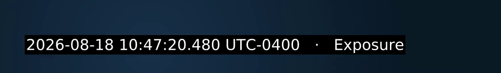
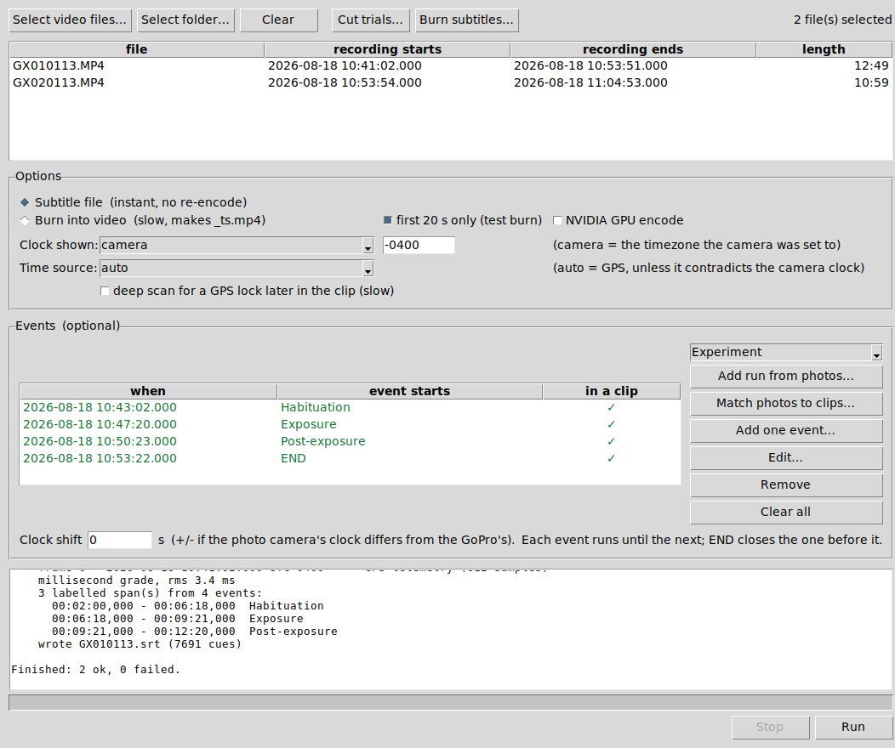
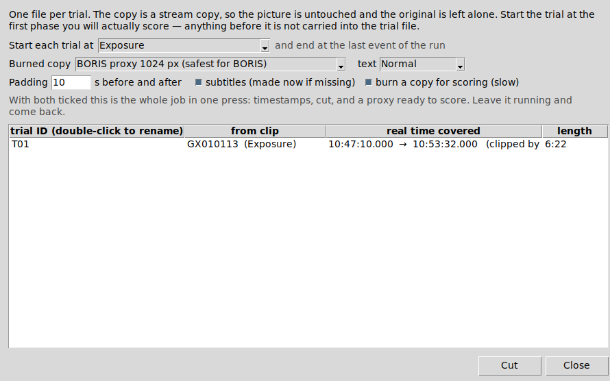

<div align="center">


# GoPro Real Time

**Recover the true wall-clock time of GoPro footage, label experimental phases from photo timestamps, and cut analysis-ready trial clips — without touching the originals.**

[](LICENSE)
[](#installation)
[](#running-from-source)
[](../../actions/workflows/build.yml)

</div>

---

Video files know when they were recorded — but that information is buried in metadata, expressed in three mutually contradictory ways, and invisible while you watch. For behavioural research, where an event at 10:47:20.480 has to be matched to a measurement logged somewhere else, that is a problem.

GoPro Real Time reads the recording time out of the file itself, puts it on screen to the millisecond, and uses it to turn a folder of long recordings into labelled, trimmed, scoreable trial clips.

<div align="center">

<br><em>A rendered frame: true recording time, and the experimental phase it falls in.</em>
</div>

## Contents

- [Why this exists](#why-this-exists)
- [What it does](#what-it-does)
- [Installation](#installation)
- [Quick start](#quick-start)
- [How the recording time is recovered](#how-the-recording-time-is-recovered)
- [Cutting trials](#cutting-trials)
- [Output formats](#output-formats)
- [Accuracy and limitations](#accuracy-and-limitations)
- [Documentation](#documentation)
- [Running from source](#running-from-source)
- [Citing](#citing)

## Why this exists

The problem it was built for: a camera records continuously for 12 minutes; the phases of an experiment inside that recording are marked by photographs taken on another camera; and the resulting footage has to be scored behaviourally, frame by frame, in software that chokes on 5.3K HEVC.

Doing that by hand means scrubbing through footage looking for the moment something happened, writing down timecodes, and hoping the two cameras agreed about the time. GoPro Real Time does it from the metadata instead: the photographs *are* the phase boundaries, and their positions inside the video are a subtraction.

Everything it writes is a new file. Original recordings are never modified.

## What it does

<div align="center">

</div>

**Shows you when each recording actually happened.** Select videos and the table fills in with the real start time, end time and duration of each clip — so a photograph's timestamp can be matched to the clip that contains it at a glance.

**Turns photographs into phase labels.** Take a photo when a phase begins and the time is already recorded in its EXIF. *Match photos to clips* scans a folder, keeps only the shots taken while the loaded videos were rolling, and turns them into labelled events. Each event runs until the next, so four photographs become three labelled phases.

**Writes the clock onto the video.** Either as a subtitle sidecar — instant, lossless, toggleable in VLC or mpv — or burned into the pixels at a resolution you choose.

**Cuts one file per trial.** From the first phase you intend to score to the end of the run, with padding, by lossless stream copy. Subtitles are re-timed to match the cut exactly, and a manifest records how every clip maps back to its source.

**Checks its own work.** Events outside a clip's time window are flagged before you run anything. Disagreements between time sources are reported rather than silently resolved.

## Installation

### Portable build (recommended)

Download `GoProRealTime_portable.zip` from [Releases](../../releases), unzip it anywhere, and double-click `GoProRealTime.exe`.

Nothing to install — no Python, no ffmpeg, no PATH changes, no registry entries. It runs from a USB stick. Keep the folder's contents together; the program uses the `ffmpeg.exe`, `ffprobe.exe` and `exiftool.exe` sitting beside it.

> On first launch Windows shows *"Windows protected your PC"*. Click **More info → Run anyway**. That warning appears for any program without a paid code-signing certificate.

### Building the portable ZIP yourself

Put these in one folder:

| File | Where from |
|---|---|
| `GoProRealTime.pyw` | this repository |
| `scripts/build_portable.bat` | this repository |
| `assets/scallop.ico` | this repository (optional, for the icon) |
| `ffmpeg.exe`, `ffprobe.exe` | [gyan.dev](https://www.gyan.dev/ffmpeg/builds/) — the *essentials* build, from `bin\` |
| `exiftool.exe` + `exiftool_files\` | [exiftool.org](https://exiftool.org) — the Windows package |

Then double-click `build_portable.bat`. It checks what is present, reports anything missing, builds with PyInstaller and produces `dist\GoProRealTime\` plus a zip ready to send.

> ExifTool ships as `exiftool(-k).exe`. You can rename it to `exiftool.exe` or leave it — both the app and the build script recognise the original name. The `exiftool_files` folder must stay beside it.

## Quick start

1. **Select video files** (or a folder). The table fills in with each clip's real recording window.
2. **Match photos to clips…** — choose the folder holding the session's photographs. Only those taken while the loaded videos were recording are listed. Select the ones marking your phases and add them as a run.
3. **Run** writes `<video>.srt` beside each clip. Open the video in VLC or mpv: the real clock appears, labelled with the phase.
4. **Cut trials…** — produces one file per trial, re-times the subtitles to match, and optionally burns a copy for scoring.

Step 4 alone is the whole pipeline: with both checkboxes ticked it creates the subtitles if they do not exist, cuts each trial, and burns a scoreable copy. Set it going and come back.

## How the recording time is recovered

Three sources, tried in order, with the more precise ones checked against the more reliable ones:

| Source | Precision | Notes |
|---|---|---|
| **GPMF GPS telemetry** | ~milliseconds | GPS-disciplined UTC from the embedded `gpmd` track. Regressed over the whole clip rather than trusting one sample. |
| **`tmcd` timecode track** | 1 frame (~17 ms) | Camera time-of-day. Frame-accurate for *relative* timing, but drifts as an absolute clock — see below. |
| **QuickTime `CreationDate`** | 1 second | Always present. The fallback. |

Each file's result is reported with a grade — `millisecond`, `frame` or `SECOND grade only` — so the precision you actually got is never a guess.

Three details that turned out to matter, and are handled:

**GPS points without a fix are rejected.** A receiver that is powered but not locked still writes telemetry: a placeholder date (often 2021-03-07) and a dilution-of-precision value of 99.99. Those samples are discarded on both tests, and a frozen or lagging clock at the head of a clip is filtered out before the fit. If no usable fix exists, the app says so instead of anchoring to garbage.

**The timecode track drifts.** GoPro counts time-of-day timecode at 60 frames per second while the video actually runs at 59.94 — about one second lost every 17 minutes since the timecode was last set. On real footage this was observed 37 s adrift. The file's own creation date therefore acts as referee: a source more than 5 s away from it is rejected.

**Sub-second anchors need a microsecond timebase.** `gmtime` in ffmpeg only accepts an integer epoch, so the fractional part of the anchor is pushed into the presentation timestamps. Without `settb=1/1000000` first, `setpts` quantises that shift to whole frames and up to 17 ms is silently lost.

## Cutting trials

<div align="center">

</div>

A *run* is a sequence of events terminated by an `END` marker, so several runs can live in one recording. For each one the dialog shows what will be produced before anything is written.

**Start each trial at** chooses the first phase to include — a habituation period you do not intend to score need not be carried into the trial file. **Padding** (10 s by default) is added either side.

Cutting is a stream copy: seconds to run, and the picture is bit-identical to the source. Because a stream copy cannot cut between keyframes, the app asks `ffprobe` exactly which keyframe the cut will land on and shifts the subtitle file by that precise amount — so the timestamps stay correct to the frame rather than drifting by up to half a second.

Each run writes `trials.csv` recording trial ID, source clip, output name, absolute start and end, offset into the clip and duration.

## Output formats

| Preset | Output | Use |
|---|---|---|
| Full resolution | `_burned.mp4` | Best detail; slowest. Try this first if fine-scale behaviour matters. |
| 4K 3840 px | `_4k.mp4` | Most of the detail at a fraction of the decoding cost. |
| 1080p 1920 px | `_1080p.mp4` | Comfortable everywhere. |
| BORIS proxy 1280 px | `_boris1280.mp4` | Small and smooth, more detail than 1024. |
| BORIS proxy 1024 px | `_boris.mp4` | Matches what BORIS's own re-encode tool targets. |
| No re-encode | `_subs.mp4` | Instant and lossless; subtitles become a switchable track. |

Every burned preset produces H.264 High profile, `yuv420p`, constant frame rate, with a keyframe every second — the combination that plays and frame-steps reliably in mpv, which is the player [BORIS](https://www.boris.unito.it) uses. See [docs/BORIS.md](docs/BORIS.md).

## Accuracy and limitations

Stated plainly, because this is research software.

**Relative timing within a recording is exact.** It comes from the video's own presentation timestamps.

**Absolute timing is only as good as its source.** With a GPS lock, milliseconds. Without one, the camera's internal clock — roughly ±1 s, and only as correct as whoever last set it.

**Aligning two cameras compounds two clock errors.** The video anchor's uncertainty plus the photo camera's own offset. The *Clock shift* field applies a measured correction; the reliable way to measure it is to film a millisecond clock with both cameras once per session.

**Timezone tags are camera settings, not facts.** A camera set to the wrong zone produces a correct local clock with a wrong UTC label. This does not affect phase alignment — that is a subtraction between two timestamps from the same clock — but it does affect any absolute UTC claim. See [docs/TIMEZONES.md](docs/TIMEZONES.md).

**The timestamp marks the start of sensor readout.** On a HERO13 at 5.3K the sensor takes ~16 ms to read top to bottom, so an event at the bottom of the frame occurred later than the label states. Relevant only below the frame interval.

**59.94 fps is not 60.** The app uses real presentation timestamps throughout, but any frame-number arithmetic you do downstream must account for it.

## Documentation

| | |
|---|---|
| [docs/PROTOCOL.md](docs/PROTOCOL.md) | Field and analysis protocol, and methods text suitable for a paper |
| [docs/BORIS.md](docs/BORIS.md) | Preparing footage for behavioural scoring in BORIS |
| [docs/TIMEZONES.md](docs/TIMEZONES.md) | Why camera clocks disagree, and how to fix and verify them |
| [docs/TROUBLESHOOTING.md](docs/TROUBLESHOOTING.md) | Common failures and what they mean |
| [scripts/](scripts/) | `find_videos.bat` — locate recordings by their embedded time, not the file date |

## Running from source

Requires Python 3.9+ with Tkinter (included in the python.org Windows installer), and `ffmpeg`, `ffprobe` and `exiftool` either beside the script or on `PATH`.

```bash
python GoProRealTime.pyw
```

On Windows, `scripts/run.bat` launches it without a console window. The application is a single file with no third-party Python dependencies; PyInstaller is needed only to build the portable bundle.

The code is organised so that the engine — metadata parsing, anchor selection, span computation, filter and command construction — sits above the Tkinter layer and has no dependency on it, which keeps it usable from a script or a future CLI.

## Citing

If this software contributes to published work, please cite it. A machine-readable [`CITATION.cff`](CITATION.cff) is included; GitHub renders a formatted citation from it in the sidebar.

This project stands on three tools that deserve citation in their own right:

- **ExifTool** — Phil Harvey, <https://exiftool.org>
- **FFmpeg** — <https://ffmpeg.org>
- **BORIS** — Friard, O. & Gamba, M. (2016). BORIS: a free, versatile open-source event-logging software for video/audio coding and live observations. *Methods in Ecology and Evolution*, 7(11), 1325–1330.

## License

[MIT](LICENSE). ExifTool and FFmpeg are separate works under their own licenses and are not distributed in this repository; the portable build bundles them locally at build time.
